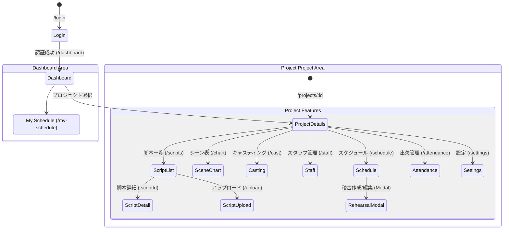

# 画面遷移図とユーザビリティレビュー

## 1. 画面遷移図 (Screen Transition Diagram)

## 2. ユーザビリティレビュー

### 総合評価
**評価: 4.0/5.0**
モダンなSPA構成（React + React Router）を採用しており、画面遷移のレスポンスは良好です。特に、稽古管理機能（Schedule）においては、モーダルベースのUIを採用することで、カレンダービューのコンテキストを維持しながら編集作業が行える点が優れています。

### 良い点 (Pros)
1.  **コンテキスト維持**: 稽古スケジュールの作成・編集をモーダルで行うため、ユーザーはカレンダー画面を行き来する必要がなく、認知負荷が低いです。
2.  **自動化による負担軽減**: 
    - 脚本のシーンを選択するだけで、必要なキャスト（参加者）が自動的に提案（チェック）される機能は、入力の手間を劇的に減らします。
    - 出欠確認期限の自動設定（「稽古当日の朝8時」）など、システム側妥当なデフォルト値を提供しています。
3.  **フィードバック**: 処理成功時にトースト通知（"Success!..."）があり、操作の結果が明確です。

### 改善の余地 (Cons & Suggestions)

#### 1. 自動化の透明性 (Visibility of System Status)
`RehearsalModal` において、参加者が自動選択された理由が視覚的にわかりにくい場合があります。
- **現状**: シーン選択 -> 即座に参加者リストのチェックボックスがONになる。
- **課題**: 「なぜこの人が選ばれたのか？（どのシーンのどの役だからか？）」が直感的に伝わらない可能性があります。
- **改善案**: 参加者リストの横に、関連する役名やシーン番号をバッジやツールチップで表示する。「シーン1: ヒーロー役」のようなヒントがあると、ユーザーの確信度が高まります。

#### 2. 「元に戻す」可能性 (User Control and Freedom)
自動計算ロジック（`useRehearsalParticipants`）は強力ですが、ユーザーが手動でチェックを外した後に、誤って別のシーンを追加・削除した際、意図せず再チェックされる（またはされない）挙動に混乱する可能性があります。
- **改善案**: "Reset to Auto"（自動計算に戻す）ボタンを設置し、手動オーバーライドと自動計算の状態を明示的に分けるとより制御しやすくなります。

#### 3. ナビゲーションの深さ
プロジェクト内の機能が多く（脚本、キャスティング、スケジュールetc）、サイドバー等のナビゲーションが必須です。
- **現状**: ルーティング上はフラットに見えますが、実際のUI（`AppLayout`）での階層表現が重要です。
- **改善案**: プロジェクト内の頻繁な移動（例：キャストを確認してからスケジュールを決める）を支援するため、パンくずリスト（Breadcrumbs）の導入を推奨します。

### 特定機能レビュー: 稽古作成フロー
- **ステップ**: カレンダー日付クリック -> モーダル表示 -> シーン選択 -> (自動参加者入力) -> 期限確認 -> 作成
- **評価**: 非常にスムーズです。特に「出欠確認を作成する」オプションが統合されているため、別画面でイベントを作成し直す必要がないのが最大の強みです。Discord連携がバックグラウンドで行われる点もUXを阻害しません。
